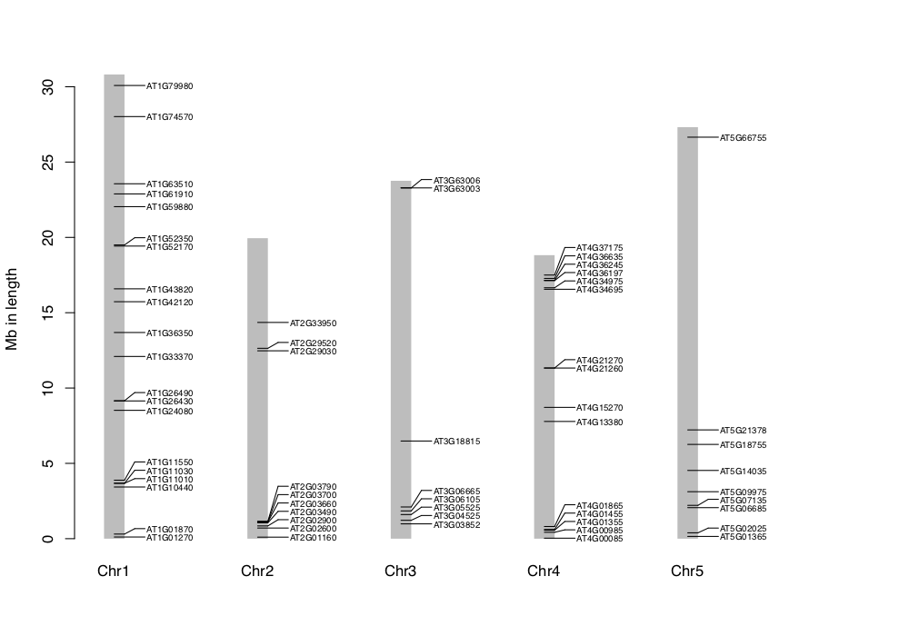
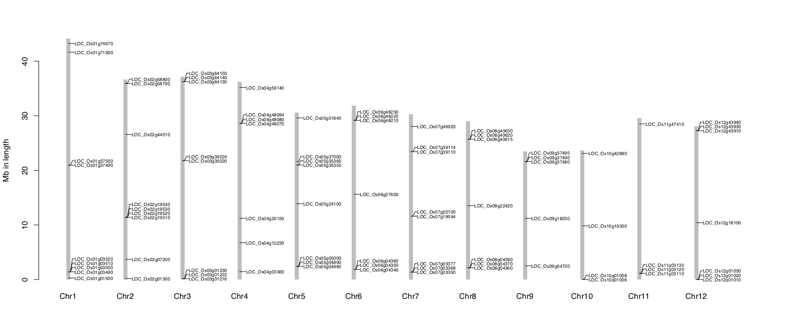

# Genes_on_Chr
Extract detailed information from __`Genes_on_Chr.R`__


## Description
__`Genes_on_Chr.R`__ can be used to draw the location of genes on chromosomes map quickly in `PDF` format based on the input data. It will become a useful tool for `drawing genes on chromosomes map` with the advantages of a simple input data format, easily modified output and very good portability. __`Genes_on_Chr.R`__ is open source, so all we ask is that you cite our most recent paper in any publications that use this script:</br>
> 基因基于R语言在染色体位置作图.</br>
> 李旭凯，郄倩茹，张丽玲，李红英.</br>
> 生物信息学，2018.</br></br>
> A tool to draw genes on chromosome based on R language.</br>
> LI Xukai, QIE Qianru, ZHANG Liling, LI Hongying.</br>
> Chinese Journal of BioInformatics, 2018.</br>

## Dependencies
All __`R`__ versions</br></br>

## Getting started
Put __`Genes_on_Chr.R`__ and data files in a same dir, then run:</br>
```
Rscript  Genes_on_Chr.R  chr.txt  gene.txt
```
</br>

The structure of __`chr.txt`__ (tab-delimited) data is: the first column is the chromosome number, and the second column is the base_pair of chromosome:</br>

```
1    Length_1
2    Length_2
3    Length_3
...  ...
```

</br>

The structure of __`gene.txt`__ (tab-delimited) data is: the first column is the chromosome number, the second column is the location of the gene, and the third column is the name of the gene:</br>
```
1    site_1       Gene_name_1
1    site_2       Gene_name_2
2    site_3       Gene_name_3
...   ...          ...
```
</br>

### If you do not have the data files
1. Get __`chr.txt`__ form __`genome.fa`__:</br>
```
perl -e '$/ = ">"; while (<>) {($head, $seq) = split (/\n/, $_, 2); $len = length $seq; $head =~ /(\d+)/; print "$1\t$len\n";}' genome.fa > chr.txt
```
</br>

2. Get __`gene.txt`__ form __`genome.gff`__:</br>
```
perl  Search.pl  list.txt  GFF3.gff  >  gene.txt
```
</br>

## Contact information
For any questions please contact xukai_li@qq.com</br>
